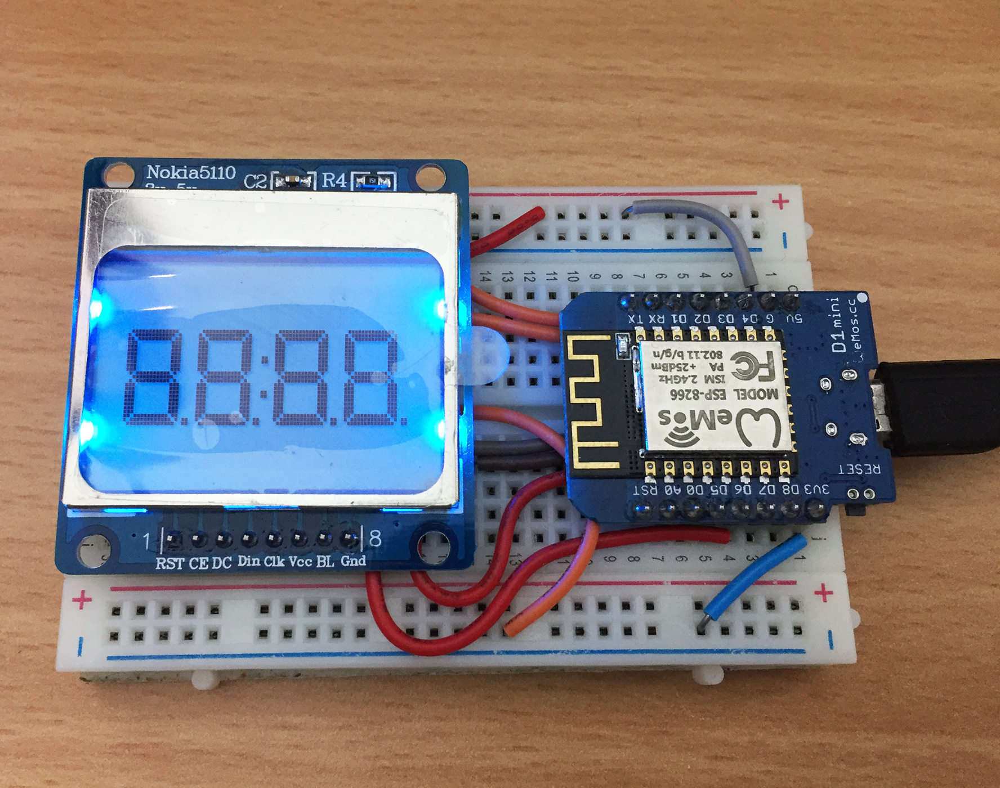

# MicroPython ESP8266 Nokia 5110 Quad 7-segment

A MicroPython library for emulating a quad 7-segment LED display modules using a Nokia 5110 display with PCD8544 driver.



The 84x48 PCD8544 buffer:


They are called 7-segment displays as there are 7 LEDs for each digit (segment).
One byte (7 lower bits) for each segment. The 8th bit (MSB) is for the decimal point.

```
      A
     ---
  F |   | B
     -G-
  E |   | C
     ---   * H
      D

  HGFEDCBA
0b01101101 = 0x6D = 109 = show "5"
```

Display | Bin        | Hex  | Dec
------- | ---------- | ---- | ---
0       | 0b00111111 | 0x3F | 63
1       | 0b00000110 | 0x06 | 6
2       | 0b01011011 | 0x5B | 91
3       | 0b01001111 | 0x4F | 79
4       | 0b01100110 | 0x66 | 102
5       | 0b01101101 | 0x6D | 109
6       | 0b01111101 | 0x7D | 125
7       | 0b00000111 | 0x07 | 7
8       | 0b01111111 | 0x7F | 127
9       | 0b01101111 | 0x6F | 111
A       | 0b01110111 | 0x77 | 119
b       | 0b01111100 | 0x7C | 124
C       | 0b00111001 | 0x39 | 57
d       | 0b01011110 | 0x5E | 94
E       | 0b01111001 | 0x79 | 121
F       | 0b01110001 | 0x71 | 113
G       | 0b00111101 | 0x3D | 61
H       | 0b01110110 | 0x76 | 118
I       | 0b00000110 | 0x06 | 6
J       | 0b00011110 | 0x1E | 30
K       | 0b01110110 | 0x76 | 118
L       | 0b00111000 | 0x38 | 56
M       | 0b01010101 | 0x55 | 85
n       | 0b01010100 | 0x54 | 84
O       | 0b00111111 | 0x3F | 63
P       | 0b01110011 | 0x73 | 115
q       | 0b01100111 | 0x67 | 103
r       | 0b01010000 | 0x50 | 80
S       | 0b01101101 | 0x6D | 109
t       | 0b01111000 | 0x78 | 120
U       | 0b00111110 | 0x3E | 62
v       | 0b00011100 | 0x1C | 28
W       | 0b00101010 | 0x2A | 42
X       | 0b01110110 | 0x76 | 118
y       | 0b01101110 | 0x6E | 110
Z       | 0b01011011 | 0x5B | 91
blank   | 0b00000000 | 0x00 | 0
\-      | 0b01000000 | 0x40 | 64
\*      | 0b01100011 | 0x63 | 99

## Parts

* [WeMos D1 Mini](http://www.aliexpress.com/store/product/D1-mini-Mini-NodeMcu-4M-bytes-Lua-WIFI-Internet-of-Things-development-board-based-ESP8266/1331105_32529101036.html) $4.00 USD
* [Nokia 5110 module](http://www.aliexpress.com/item/1pc-Lowest-Price-84-48-84x84-LCD-Module-White-backlight-adapter-PCB-for-Nokia-5110-Newest/32401396134.html) $2.10 USD
* [Breadboard 400 point](http://www.aliexpress.com/item/Quality-mini-bread-board-breadboard-8-5CM-x-5-5CM-400-holes/32347239015.html) $1.02 USD
* [Jumper wire](http://www.aliexpress.com/item/Free-Shipping-140pcs-in-one-package-convenient-New-Solderless-Flexible-Breadboard-Jumper-wires-Cables-HOT-Sale/2044172287.html) $1.72 USD

## Connections

WeMos D1 Mini | Nokia 5110 PCD8544 LCD
------------- | ---------------
D3 (GPIO0)    | 0 RST
D4 (GPIO2)    | 1 CE
D8 (GPIO15)   | 2 DC
D7 (GPIO13)   | 3 Din
D5 (GPIO14)   | 4 Clk
3V3           | 5 Vcc
D6 (GPIO12)   | 6 BL
G             | 7 Gnd

## Links

* [MicroPython PCD8544 Driver](https://github.com/mcauser/micropython-pcd8544)
* [WeMos D1 Mini](https://wiki.wemos.cc/products:d1:d1_mini)
* [micropython.org](http://micropython.org)
* [TM1637 version](https://github.com/mcauser/micropython-tm1637)

## License

Licensed under the [MIT License](http://opensource.org/licenses/MIT).
